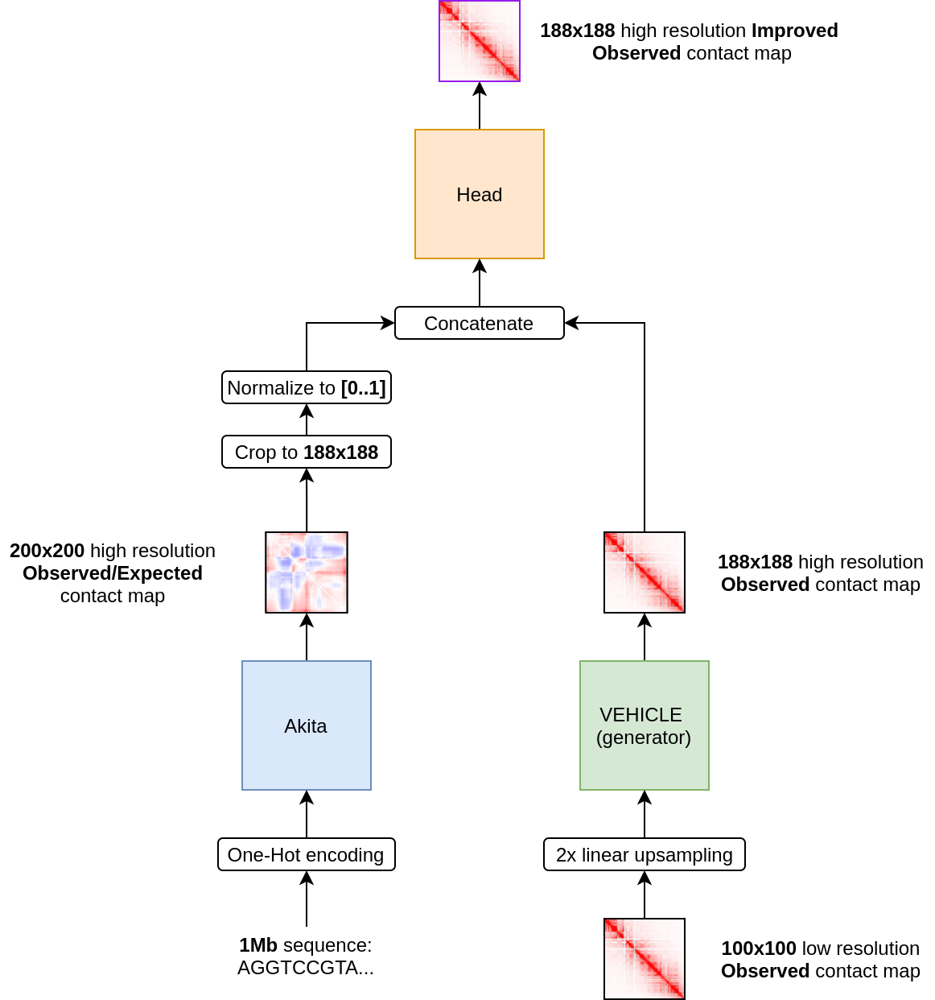
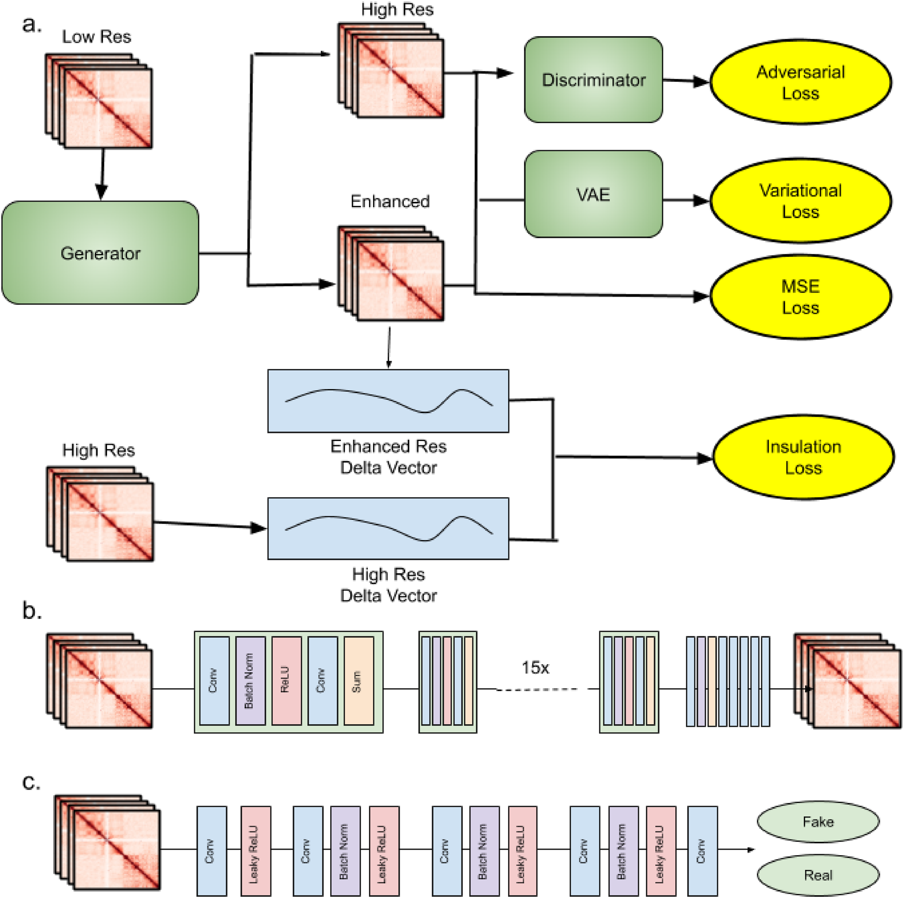
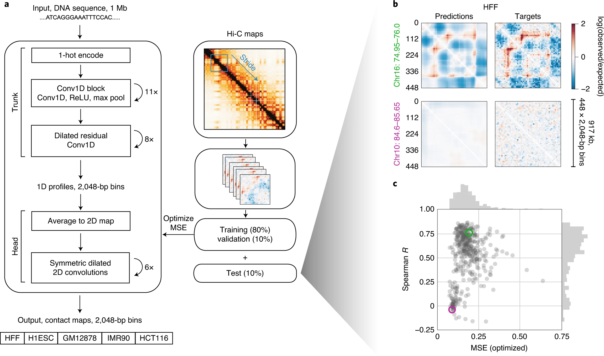

## Environment setup

``` bash
python3 -m pip install -r requirements.txt
```

## Model Training

To launch training you can just run hypermodel.py

``` bash
python3 hypermodel.py
```

model logs can be checked at https://app.neptune.ai/koritsky/DL2021-Bio

## Model Evaluation on the test set
Download datasets from https://drive.google.com/drive/folders/1wy0lwgR_zzb2GDVkwRELqITkSY1jt6v8 and put it into the dataset/ directory


<!---
All this should be 
commented out
<br>

Before evaluation download weights from if you want akita with convolutional head https://drive.google.com/file/d/1oEoIGMc5Hl1ragEuR0gYyTuRf1hSbIRs/view?usp=sharing

<br>

and if you want akita with graph head download https://drive.google.com/file/d/1oEoIGMc5Hl1ragEuR0gYyTuRf1hSbIRs/view?usp=sharing

<br>
-->


To start evaluating run ...
``` bash
python3 eval.py --model model_type --checkpoint PATH_TO_WEIGHTS --cuda 1 --plot 2
```
PATH_TO_WEIGHTS is hypermodel.pth or hypermodel-graph.pth
model_type is conv or graph

## Hybrid model

The key idea of our model is incorporation of information about a DNA sequence to a low resolution image to obtain an image with higher resolution



## VeHiCLE model

VEHiCLE, a DL algorithm for resolution enhancement of Hi-C contact data.



```
@article{VEHiCLE,
  title={VEHiCLE: a Variationally Encoded Hi-C Loss Enhancement algorithm for improving and generating Hi-C data},
  author={Highsmith, Max and Cheng, Jianlin},
  journal={Scientific Reports},
  volume={11},
  number={1},
  pages={1--13},
  year={2021},
  publisher={Nature Publishing Group}
}
```

## Akita model

Sequence-to-image model that accurately predicts genome folding from DNA sequence.



```
@article{Akita,
  title={Predicting 3D genome folding from DNA sequence with Akita},
  author={Fudenberg, Geoff and Kelley, David R and Pollard, Katherine S},
  journal={Nature Methods},
  volume={17},
  number={11},
  pages={1111--1117},
  year={2020},
  publisher={Nature Publishing Group}
}
```

